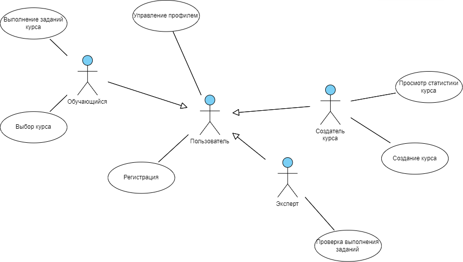

## Бизнес-требования
Проект заключается в создании онлайн-платформы для обучения, где пользователи могут получать доступ к разнообразным образовательным курсам через интернет. Эта платформа предоставляет возможность обучения в удобное для пользователя время и место, используя доступ к сети интернет.

## Действующие лица
С системой взаимодействуют следующие действующие лица:
- Пользователь - человек, использующий систему

- Обучающийся - человек, который хочет пройти какой-нибудь курс

- Создатель курса - пользователь, который создает новый курс для обучающихся

- Эксперт - пользователь, проверяющий выполнения заданий обучающимися

## Варианты использования

Варианты использования - высокоуровневые сценарии, описывающие задачи, которые
выполняет система и действующие лица, которые в этих сценариях участвуют.

### Пользователь

- Управление данными своего профиля
- Отправка сообщений: 
    * Обучающемуся
    * Эксперту

### Обучающийся

- Выбор интересующего курса для прохождения
- Выполнение заданий курсов, которые он проходит
- Получает мотивационные оповещения о необходимости продолжения курса

### Создатель курса

- Разрабатывает и выкладывает на платформу свой курс
- Ведет статистику о сложности и понятности курса обучающимися

### Эксперт

- Проверяет задания на ошибки, контролирует их выполнение обучающимися
- Отвечает на возникшие вопросы. При необходимости общается с создателем курса

Диаграмма вариантов использования приведены на следующем рисунке:

